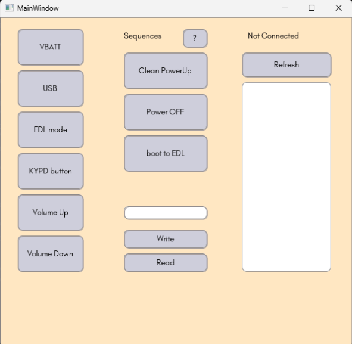

# Promira-prime
A solution to replace the popular USB-to-SPI Promira dongle in the lab.

This software was developed to address the lack of sufficient Promiras in the lab. It offers the basic capabilities of Promira to debug basic issues or assist in firmware development. This is a quick and cost-effective alternative, designed during the height of the global silicon shortage.

---

### The Hardware Part
**Platform:** Arduino Nano  
- The USB-to-serial (UART) bridge chip on Nano provides UART input/output.  
- Custom logic on the ATmega328P MCU converts UART commands to SPI write commands.  
- For read commands, it reads SPI data and sends it back via UART.  

**In short:** Arduino Nano acts as a UART-to-SPI converter.

CS, SCK, MOSI, MISO = GPIO-10, GPIO-13, GPIO-11, GPIO-12

---

### The Software Part
Implements custom logic for:
- Reading/writing UART data  
- Interpreting the data  

Provides:
- A user interface for interaction  
- Extra capabilities not present in the default Promira application  

---

## Installation
1. Flash the firmware `.ino` file into Arduino Nano.  
2. Pull out wires from Nano and connect to your setup.  
3. Install libraries from `requirements.txt`.  
4. Run `main.py` and voila!  

---

### Libraries
- `pyserial`  
- `dearpygui`  

### Snapshot
